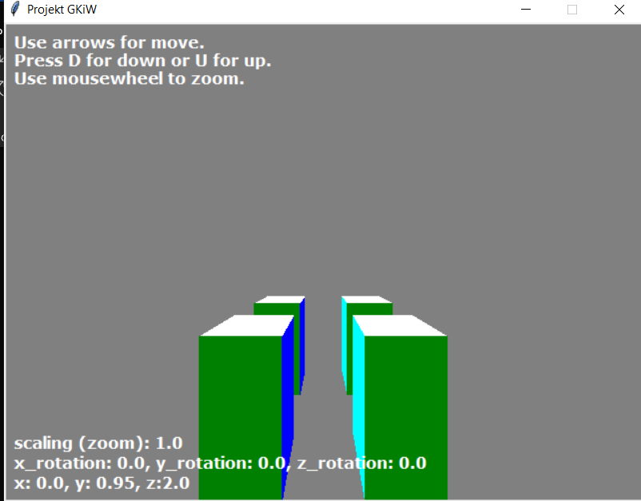
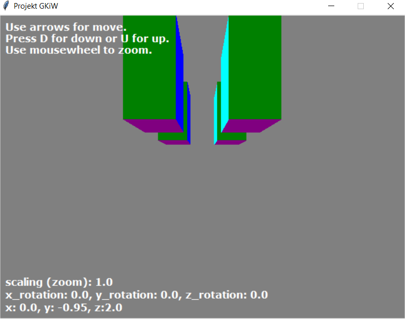
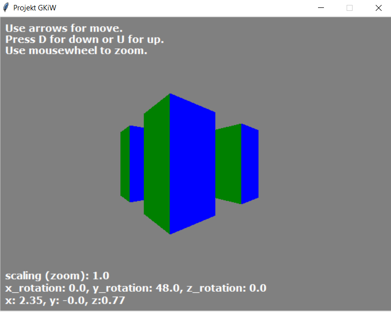
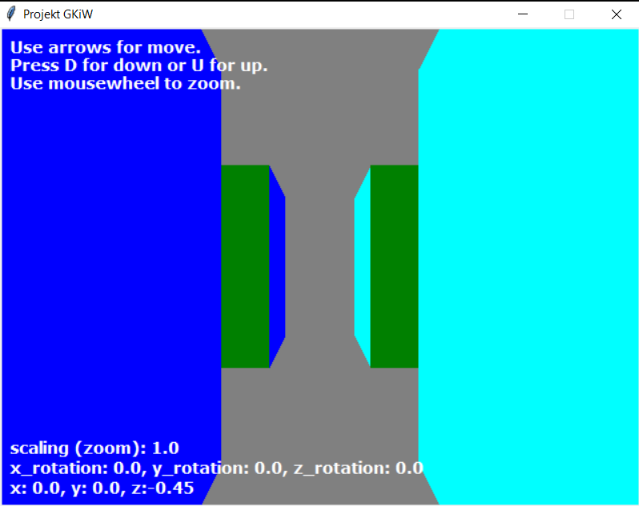
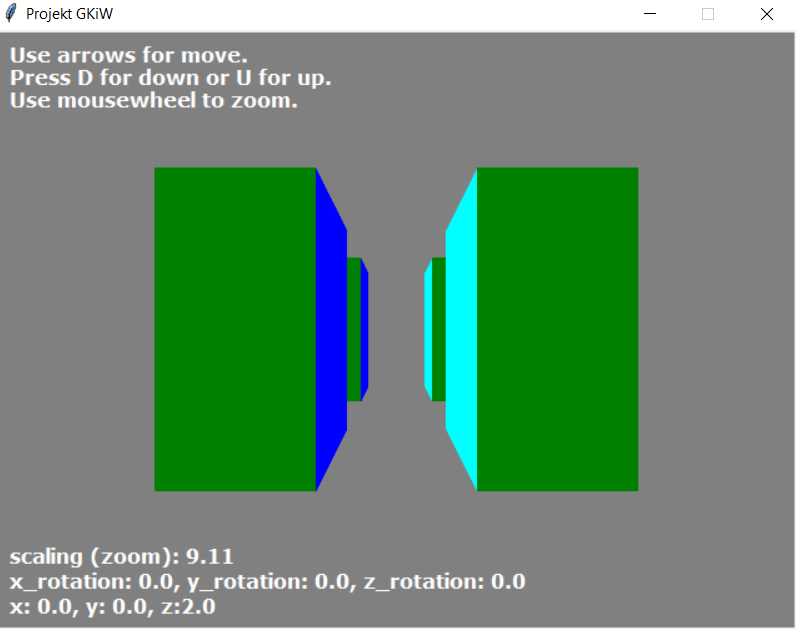
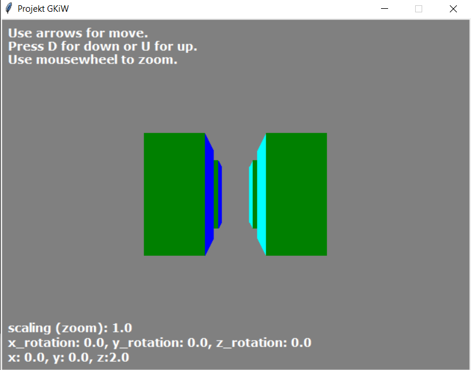

# Introduction

The virtual camera and elimination of hidden elements.
The program is implemented using the Python programming language with the tkinter and math libraries built into the language. 
In order to facilitate the performance of operations on vectors and matrices, I used the classes found to support this type of operations, 
the source is included in the matrix.py file.
The main program implementing the virtual camera is in the virtual_camera.py file. 
Comments describe all operations performed while the program is running.

*Program view*

# The process of making and sample photos

The scene consists of 4 cubes arranged in two rows, at equal distances from each other.
For displaying the 2D view and for all transformations in the 3D world, I used operations on matrices as well as folding 
transformations, projections and perspective transformations to achieve the effect as close to reality as possible.

*View from above*

*Bottom view*

*Perspective view*

*View from inside*

*Zoom*

*Original size*

# Elimination of obscured objects

In order to eliminate the obscured elements, I used the painting algorithm:
1. Sort the polygons in the order resulting from the depth (distance from the observer)
2. Resolve any ambiguities
3. Draw in order from the farthest

In the case of the scene I was realized, I had no problem with ambiguity, the objects do not overlap, 
and it was quite easy to tell from the distance which object is closer to the camera.

For optimization, I also used the Backface culling removal technique. It consists in not drawing the back walls from 
the camera's point of view.

# User manual

### Activation
You can run the program using the attached virtual_camera.exe file.

### Screen

##### The following information is displayed on the screen:

* the current position of the camera in the virtual world by displaying the x, y and z coordinates
* camera rotation in the x, y and z axes
* the scaling factor through which the zoom operation is performed
* control manual

#### Control manual:

* arrows - moving the camera on the plane (X, Z axis and rotation)
* D (down) key - lowering the camera down (Y axis)
* U (up) key - raising the camera up (Y axis)
* mouse wheel - zoom, zoom in / out the view by scaling
